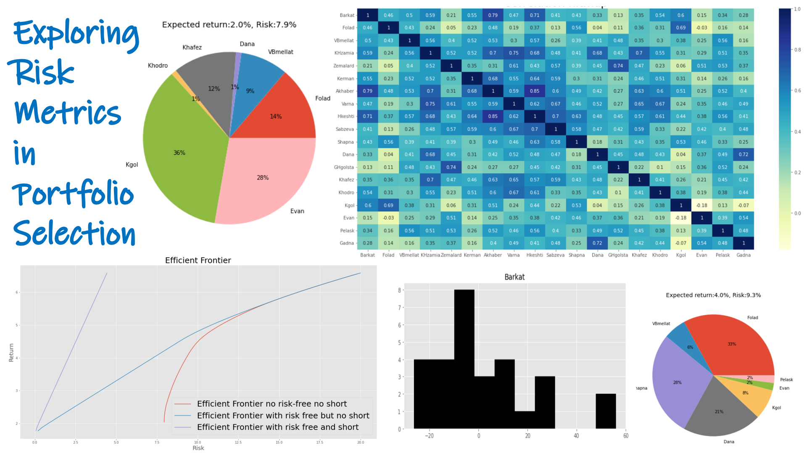

# Exploring Risk Metrics in Portfolio Selection
This project explores various risk measurement methods in the context of portfolio selection for stocks from Tehran's stock market. The goal is to build efficient portfolios using different risk metrics. This README provides an overview of the project and its main components.
This project was completed collaboratively by me and my colleague, [**Mahyar Mohammadi Matin**](https://mahyarmohammadi.top/), as research project of our Nonlinear Programming course.

## Table of Contents
- [Introduction](#introduction)
- [First Approach for Portfolio Selection](#first-approach-for-portfolio-selection)
    - [Return-Variance Graph](#return-variance-graph)
    - [Correlation Heatmap](#correlation-heatmap)
    - [Markowitz Mean-Variance Approach](#markowitz-mean-variance-approach)
    - [Plotting Efficient Frontier](#plotting-efficient-frontier)
- [Adding ETF, Gold, and Non-Risk Assets](#adding-etf-gold-and-non-risk-assets)
- [Second Approach for Portfolio Selection](#second-approach-for-portfolio-selection)
- [Third Approach for Portfolio Selection](#third-approach-for-portfolio-selection)
- [Fourth Approach for Portfolio Selection](#fourth-approach-for-portfolio-selection)

## Introduction

In this project, we explore various risk metrics to build efficient portfolios for stocks from Tehran's stock market. The project is divided into several approaches, each focusing on different risk measurement methods and portfolio optimization techniques.

## First Approach for Portfolio Selection

### Return-Variance Graph

The project starts with a Return-Variance graph, plotting the returns and standard deviations of selected stocks.

### Correlation Heatmap

A correlation heatmap is generated to visualize the correlations between stock returns.

### Markowitz Mean-Variance Approach

The Markowitz mean-variance approach is implemented using the `cvxpy` library to optimize portfolio weights. Portfolio optimization is performed with and without the option to short-sell.

### Plotting Efficient Frontier

Efficient frontiers are plotted to visualize the trade-off between risk and return for various portfolio compositions.

## Adding ETF, Gold, and Non-Risk Assets

The project expands the portfolio by adding ETF, Gold, and Non-Risk assets. This allows for a comparison of portfolios with different risk profiles.

## Second Approach for Portfolio Selection

The second approach involves a statistical method for portfolio optimization based on a given probability value.

## Third Approach for Portfolio Selection

Three different kinds of Value at Risk (VaR) metrics are implemented:

1. Historical VaR
2. Parametric VaR
3. Monte Carlo VaR

These metrics are used to assess portfolio risk, and portfolios are optimized accordingly.

## Fourth Approach for Portfolio Selection

The fourth approach focuses on Maximum Drawdown (MDD) optimization. Portfolios are optimized to minimize the maximum drawdown while targeting a specific expected return.
